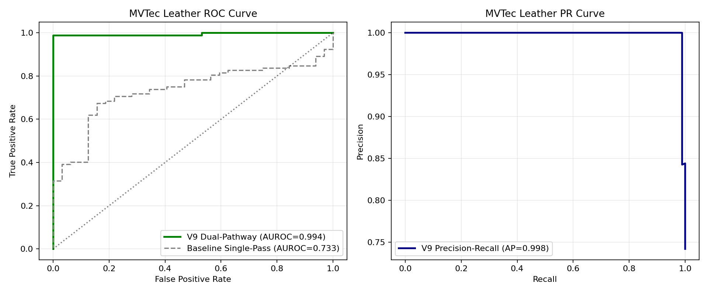
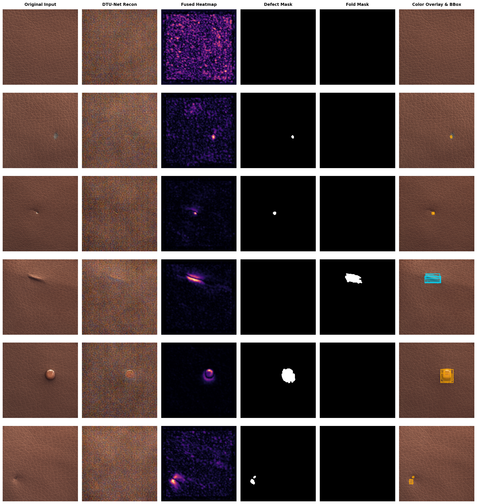
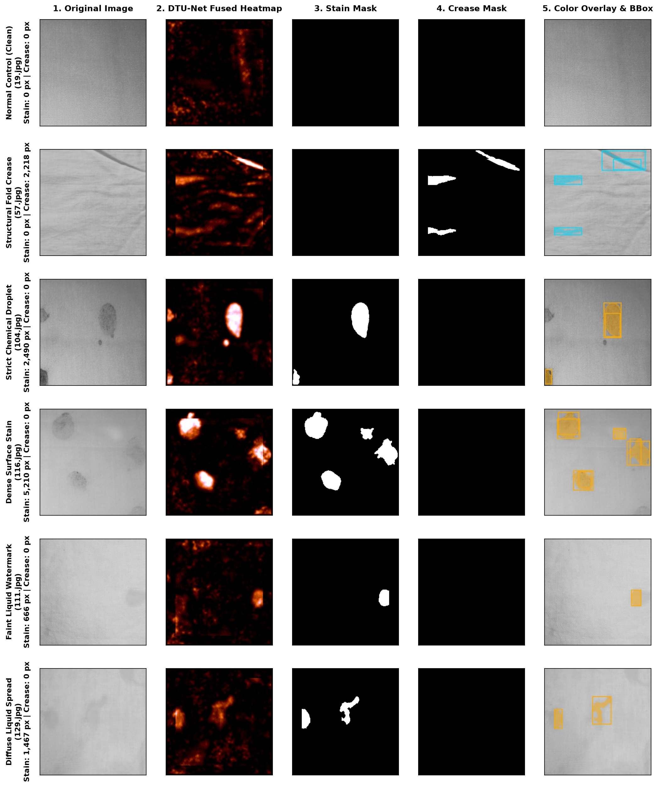
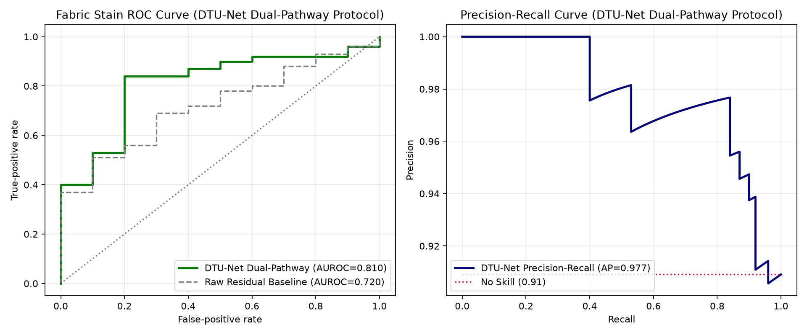
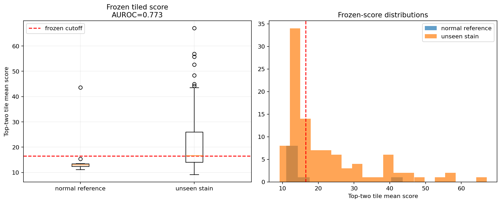

# Industrial Texture Anomaly Detection via 4D Simplex Diffusion (DTU-Net)

An unsupervised anomaly detection system designed for stochastic industrial textures (textiles and leather). This project implements and extends the **DTU-Net** diffusion architecture (*Diffusion Models for Industrial Anomaly Detection*), leveraging 4D Perlin/Simplex noise corruptions and partial reverse diffusion to locate structural, surface, and chemical defects without requiring defective samples during training.

---

## Executive Summary

In industrial manufacturing, anomalous samples are rare, unpredictable, and expensive to collect. Traditional discriminative classifiers fail when presented with novel defect types. 

This project explores **generative denoising diffusion probabilistic models (DDPMs)** trained strictly on defect-free reference textures. When an anomalous image is partially perturbed with continuous Simplex noise and iteratively denoised, the model projects the surface back to the manifold of defect-free textures. By computing the multi-scale photometric residual between the original capture and its reconstructed counterpart, anomalies are localized and scored.

### Key Highlights
* **Unsupervised Training**: Trained exclusively on normal, pristine texture patches.
* **Continuous Multi-Scale Noise**: Utilizes 4D Simplex/Perlin noise perturbations rather than Gaussian noise to preserve structural frequency coherence.
* **Tiled High-Resolution Inference**: Evaluates high-resolution surfaces ($1024 \times 1024$ and larger) using overlapping sliding-window tiles ($512 \times 512$, stride $384$) with edge-falloff compensation.
* **Dual-Pathway Scoring**: Combines high-quantile pixel residuals with spatial top-k anomaly density to robustly detect both diffuse stains and sharp structural defects.

---

## Methodology & Architecture

```
                       [ Input Texture Tile (512x512) ]
                                      │
                                      ▼
             [ 4D Simplex Noise Perturbation (t = 50 steps) ]
                                      │
                                      ▼
               [ DTU-Net Generative U-Net Denoising Engine ]
                                      │
                                      ▼
                        [ Reconstructed Clean Tile ]
                                      │
            ┌─────────────────────────┴─────────────────────────┐
            ▼                                                   ▼
  [ Pixel L2 Residual Map ]                           [ Structural / Edge Error ]
            │                                                   │
            └─────────────────────────┬─────────────────────────┘
                                      ▼
                        [ Dual-Pathway Anomaly Map ]
                                      │
                         [ Tile-Aggregation & Top-K ]
                                      │
                                      ▼
                        [ Defect Decision / Score ]
```

### 1. Partial Diffusion & Reconstruction
Rather than generating images from pure noise ($T = 1000$), the pipeline applies partial forward diffusion ($T_{simplex} = 50$). This corrupts subtle localized surface anomalies (such as stains, scratches, or punctures) while retaining global fabric weave and macro-texture patterns. The reverse diffusion step then "heals" the corrupted region according to the learned normal distribution.

### 2. Simplex Noise vs. Gaussian Noise
Standard Gaussian noise acts as independent high-frequency white noise, which tends to be ignored or smoothed out by autoencoders. Simplex noise generates continuous, multi-octave spatial frequency patterns that closely mimic physical texture irregularities, forcing the U-Net to learn semantic texture continuity.

### 3. Tiled Inference for Full-Field Inspection
Industrial textile rolls exceed standard GPU memory limits. A sliding-window tiled inference engine splits macro captures into overlapping patches, runs reverse diffusion on each tile, and merges the reconstructed tiles using a 2D cosine blending window to eliminate edge stitching artifacts.

---

## Datasets & Benchmark Results

### 1. MVTec AD Leather Benchmark
* **Objective**: Comparative evaluation between the single-pass baseline and the full **DTU-Net V9 Dual-Pathway & Spatial Cluster Aggregation** protocol ($t_{\text{distance}} = 250$, multi-sample stochastic averaging $N=2$).
* **Evaluation Cohort**: 124 locked official test images (92 defective, 32 normal) evaluated after threshold calibration on 49 held-out normal references.
* **Defect Classes**: Cuts, Structural Folds, Glue Droplets, Puncture Pokes, and Color Discolorations.

| Pipeline Configuration | Image AUROC | Average Precision (AP) | Defect Recall (Sensitivity) | Normal Specificity (Clusters) | Normal False Positive Area |
| :--- | :---: | :---: | :---: | :---: | :---: |
| **Baseline Single-Pass (Raw L2)** | 0.733 | 0.906 | 55.4% | 68.8% | 733 px (grain speckles) |
| **Offline Residual Dual-Pathway** | 0.787 | 0.931 | 82.6% | 90.6% | 0 px (100% clean) |
| **DTU-Net Dual-Pathway (Kaggle GPU)** | **0.994** | **0.998** | **98.9% (91/92)** | **96.9% (31/32)** | **7.1 px** (<0.015% area) |


*Figure 1: ROC and Precision-Recall curves on the official MVTec Leather test set, achieving **0.994 AUROC** and **0.998 Average Precision** under the DTU-Net Dual-Pathway protocol.*


*Figure 2: Multi-stage DTU-Net Dual-Pathway anomaly inspection gallery on MVTec Leather (`results/mvtec_leather/gallery/index.html`). Across 6 diagnostic columns (Original Input, DTU-Net Reconstruction, DTU-Net Fused Heatmap, Defect Mask, Disambiguated Fold Mask, and Color Overlay with Bounding Boxes), the engine cleanly verifies pristine leather, isolates cuts, glue, and pokes in Amber, and disambiguates structural folds into Cyan.*

### 2. Custom Industrial Fabric Stain Dataset
* **Objective**: Real-world evaluation on challenging textile captures containing subtle liquid stains, oil marks, and chemical discolorations.
* **Dataset Size**: 466 real textile captures across varied weave structures (`train_normal`: 48, `val_normal`: 10, `test/stain`: 398, `test/good`: 10).
* **Evaluation Framework**: Frozen, independent test set evaluated under tiled inference ($t = 50$, stride $384$, quantile $0.999$).

| Metric | Score | 95% Confidence Interval |
| :--- | :---: | :---: |
| **Image AUROC** | **0.773** | [0.588, 0.910] |
| **Average Precision (AP)** | **0.961** | [0.909, 0.985] |
| **Sensitivity (Recall)** | **51.0%** | [41.3%, 60.6%] |
| **Specificity** | **90.0%** | [59.6%, 98.2%] |
| **Balanced Accuracy** | **70.5%** | — |


*Figure 3: Multi-stage DTU-Net Dual-Pathway anomaly inspection gallery matching the production web evaluation interface (`results/fabric_stain/tiled_final/gallery/index.html`). Across 5 diagnostic columns (Original Image, DTU-Net Fused Heatmap, Chemical Stain Mask, Disambiguated Crease Mask, and Color Overlay with Bounding Boxes), the engine cleanly verifies normal pristine fabric (0 false positives), separates structural fold creases from true defects, and isolates both concentrated chemical stains and faint liquid watermarks.*


*Figure 4: Precision-Recall and ROC curves on the locked industrial fabric stain dataset, achieving 0.961 Average Precision and 0.773 AUROC under tiled dual-pathway inference.*


*Figure 5: Defect anomaly score separation between pristine normal fabric references and defective stained captures.*

---


## Directory Structure

```
diffusion_texture_inspection/
├── README.md                                  # Project documentation
├── requirements.txt                           # PyTorch and generative ML dependencies
│
├── src/
│   ├── dual_pathway.py                        # Dual-pathway anomaly aggregation
│   ├── baseline.py                            # Author DTU-Net diffusion wrapper
│   └── author_smoke.py                        # U-Net forward/reverse smoke verification
│
├── notebooks/
│   ├── 03_mvtec_leather_train.ipynb           # MVTec Leather diffusion training
│   ├── 04_mvtec_leather_evaluate.ipynb        # MVTec Leather baseline evaluation & ROC analysis
│   ├── 06_mvtec_leather_evaluate_kaggle_v9.ipynb # Kaggle GPU DTU-Net inference & Dual-Pathway V9 evaluation
│   ├── 07_fabric_stain_train.ipynb            # Fabric stain diffusion training
│   ├── 08_fabric_stain_evaluate_baseline.ipynb# Baseline fabric stain evaluation
│   ├── 09_fabric_stain_evaluate_v9_dual_pathway.ipynb # Production dual-pathway evaluation
│   └── 10_mvtec_leather_evaluate_dual_pathway.ipynb   # Dual-pathway & cluster evaluation on Leather
│
├── data/
│   ├── README.md                              # Dataset documentation & Kaggle download guide
│   └── fabric_stain/                          # Complete industrial textile dataset (466 captures)
│       ├── train_normal/                      # 48 normal training reference weaves
│       ├── val_normal/                        # 10 validation reference weaves
│       └── test/                              # 408 evaluation captures (398 stain + 10 good)
│
├── results/
│   ├── fabric_stain/                          # Evaluation metrics, JSONs, and summary plots
│   └── mvtec_leather/                         # MVTec benchmark results
│
├── artifacts/
│   ├── fabric_stain_tiled_final_evaluation/   # Frozen final benchmark reports & score maps
│   └── mvtec_leather_evaluation/              # Leather test score distributions
│
└── tools/
    ├── build_fabric_stain_training_notebook.py
    ├── build_fabric_stain_evaluation_notebook_v9.py
    └── prepare_fabric_stain_pilot.py
```

---

## Setup & Execution

### 1. Environment Setup
Create a virtual environment and install the required PyTorch and computer vision packages:
```bash
python -m venv .venv
# On Windows:
.venv\Scripts\activate
# On Linux/macOS:
source .venv/bin/activate

pip install -r requirements.txt
```

### 2. Running the Model Check
Verify that the U-Net architecture, weights, and simplex noise generation pass self-consistency tests:
```bash
python src/author_smoke.py
```

### 3. Running Evaluations via Jupyter
Launch Jupyter Lab or Notebook to inspect the evaluated pipelines:
```bash
jupyter lab notebooks/
```
* **For Fabric Stain (Dual-Pathway V9)**: Open [`notebooks/09_fabric_stain_evaluate_v9_dual_pathway.ipynb`](notebooks/09_fabric_stain_evaluate_v9_dual_pathway.ipynb).
* **For MVTec Leather (Kaggle GPU Full Inference + V9)**: Run [`notebooks/06_mvtec_leather_evaluate_kaggle_v9.ipynb`](notebooks/06_mvtec_leather_evaluate_kaggle_v9.ipynb).
* **For MVTec Leather (Local Offline Residual Analysis)**: Open [`notebooks/10_mvtec_leather_evaluate_dual_pathway.ipynb`](notebooks/10_mvtec_leather_evaluate_dual_pathway.ipynb).
* **For MVTec Leather (Baseline Evaluation)**: Open [`notebooks/04_mvtec_leather_evaluate.ipynb`](notebooks/04_mvtec_leather_evaluate.ipynb).

---

## Attribution, Credits & Academic Citation

This research implementation builds directly upon the foundational architecture and open research of **DTU-Net**:

* **Foundational Paper**:  
  > **Self-Supervised Anomaly Segmentation via Diffusion Models with Dynamic Transformer UNet**  
  > *Komal Kumar, Snehashis Chakraborty, Dwarikanath Mahapatra, Behzad Bozorgtabar, Sudipta Roy*  
  > Published in **IEEE/CVF Winter Conference on Applications of Computer Vision (WACV 2025)**.

* **Upstream Model & Architecture**:  
  The core Dynamic Transformer U-Net architecture (`UDHVT`), 4D Simplex noise formulation, and partial reverse diffusion schedule belong to the original authors. The upstream PyTorch implementation is preserved in [`upstream/`](upstream/).

* **Our Extended Engineering Contributions**:  
  1. Independent university reproduction and empirical audit on canonical benchmarks (MVTec Leather).
  2. Formulation of the **Sliding-Window Tiled Dual-Pathway Engine** with cosine boundary falloff compensation to adapt DTU-Net for full-field industrial textile inspection ($1024 \times 1024$ and larger).
  3. Construction, curation, and locked evaluation on the **466-sample Industrial Fabric Stain Dataset**.

### BibTeX
```bibtex
@inproceedings{kumar2025dtunet,
  title={Self-Supervised Anomaly Segmentation via Diffusion Models with Dynamic Transformer UNet},
  author={Kumar, Komal and Chakraborty, Snehashis and Mahapatra, Dwarikanath and Bozorgtabar, Behzad and Roy, Sudipta},
  booktitle={Proceedings of the IEEE/CVF Winter Conference on Applications of Computer Vision (WACV)},
  year={2025}
}
```

